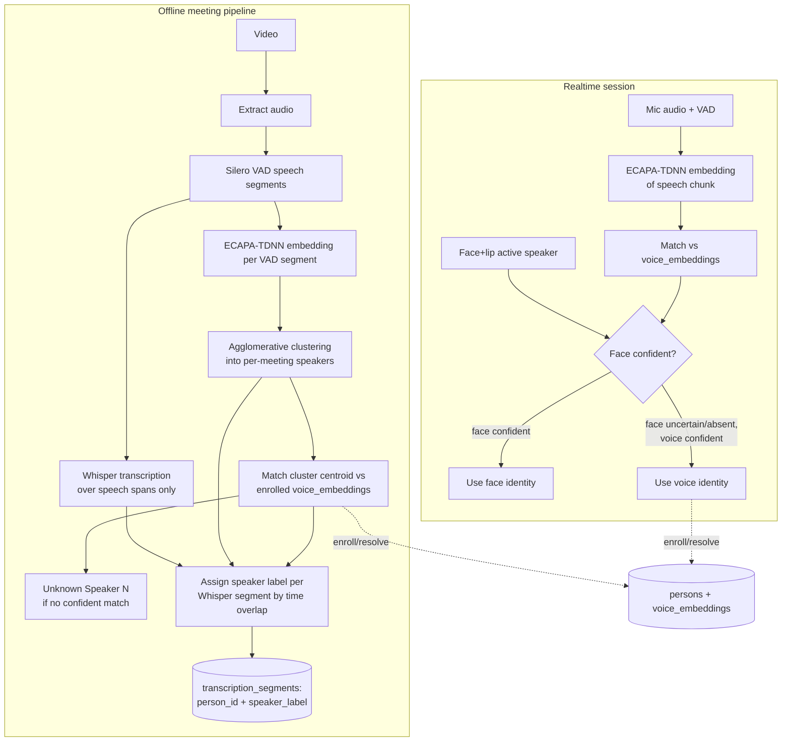

# Transcript Accuracy, Voice Diarization, and Voice Recognition

## Problem

The offline meeting transcription pipeline (`transcription_core.py`) transcribes audio with Whisper but has no real speaker separation: `transcribe_with_diarization` accepts an optional `diarize` callback, and nothing currently implements one, so every segment is labeled `"Unknown Speaker"`. `transcription_segments` already has a `person_id` column, but it is never populated. Separately, the realtime pipeline (`video_processor.py`, `realtime.py`) already attributes speech to a person, but only via a visual signal (lip movement + face recognition) — there is no audio/voice biometric signal anywhere in the codebase.

This leaves three gaps:
1. Whisper transcription accuracy is untuned (no VAD gating, default hallucination-prone decoding settings).
2. Audio is never split into distinct speakers ("who spoke when", independent of identity).
3. Speakers are never matched to enrolled identities from their voice, and there's no enrollment path for voiceprints.

## Goals

- Reduce Whisper transcription errors/hallucinations in the offline pipeline.
- Diarize offline meeting audio into distinct speaker clusters.
- Match diarized clusters (offline) and live speech (realtime) against enrolled voiceprints; label unmatched speakers as `Unknown Speaker N` rather than guessing.
- Let a person accumulate a voiceprint two ways: an explicit enrollment step, or by naming a previously-unknown voice cluster (mirrors the existing unknown-face flow).
- When an unknown voice/face is resolved to a person, or a person is renamed, propagate that identity to all past and future transcript segments and audio logs for that person — labels stay in sync everywhere.
- In the realtime pipeline, use voice identity only as a fallback confirmation when face recognition is absent/low-confidence; never let it override a confident face match.

## Non-Goals

- Real-time streaming diarization for overlapping/cross-talk speech beyond what VAD-based segmentation naturally handles.
- Replacing face recognition as the primary realtime identity source.
- Building a new UI framework — enrollment/resolution UI additions reuse `app.py`'s existing unknown-face review page patterns.
- Multi-language transcription tuning beyond what `config` already exposes.

## Architecture



A new module, `voice_core.py`, mirrors `face_core.py`'s shape: embedding extraction, cosine-similarity matching against enrolled voiceprints, and unknown-voice clustering/registration helpers.

## Transcript accuracy improvements

Changes confined to `transcription_core.py` / `config.py`, independent of diarization:

- Gate Whisper on Silero VAD speech spans (reuse `audio_core.detect_speech_segments`) instead of transcribing raw audio, eliminating Whisper's hallucination-on-silence failure mode.
- Pass `condition_on_previous_text=False` to stop repetition-loop hallucinations across segments.
- Add `WHISPER_LANGUAGE` / `WHISPER_INITIAL_PROMPT` config options, defaulting to `None` (auto-detect, no prompt) to preserve current behavior while making tuning straightforward.
- Request word-level timestamps (`word_timestamps=True`) so speaker-boundary alignment (below) is more precise than sentence-level timestamps.

## Diarization (voice differentiation) — offline

- For each Silero VAD speech segment, compute a speaker embedding with SpeechBrain's `spkrec-ecapa-voxceleb` model (public on Hugging Face, no gated license/token required).
- Cluster segment embeddings with agglomerative clustering (cosine distance, distance-threshold based, so the speaker count doesn't need to be known ahead of time) to produce per-meeting speaker clusters.
- Feed the resulting `(cluster_label, start_seconds, end_seconds)` list into `transcribe_with_diarization`'s existing `diarize` callable parameter — the current overlap-matching logic that assigns a label to each Whisper segment is reused as-is.

## Voice recognition and enrollment

New tables in `database.py`, matching the shape of `unknown_tracks` / `unknown_samples`:

- `voice_embeddings(embedding_id, person_id, embedding_path, quality, created_at)` — enrolled voiceprints, linked to the same `persons` table used for faces. A person may have a face profile, a voice profile, or both.
- `unknown_voices(unknown_voice_id, label, embedding_path, created_at, resolved_person_id)` and `unknown_voice_samples(sample_id, unknown_voice_id, embedding_path, quality, created_at)` — clusters that don't match any enrolled voiceprint, with cascade delete on the parent row.

Matching flow:
- Each diarized cluster's centroid embedding is compared against enrolled `voice_embeddings` by cosine similarity. A match above a configurable threshold assigns that person's name/`person_id`. No match saves the cluster's samples under `unknown_voices` as `"Unknown Speaker N"`.

Enrollment flow (both paths supported):
- **Explicit**: `app.py` gains a small section (next to the existing face-enrollment UI) to upload/record a clean voice sample per person, generating a `voice_embeddings` row directly.
- **From unknown clusters**: naming an `unknown_voices` row (same UX as the existing `resolve_unknown` flow for faces) creates/updates that person's `voice_embeddings` and calls a new `resolve_unknown_voice(unknown_voice_id, person_id)`.

## Sync behavior (retroactive relabeling)

- `transcription_segments.speaker_label` is derived from `persons.name` via the stored `person_id` wherever one is set, rather than only stored as a frozen string — so renaming a person in `persons` is reflected the next time a meeting's transcript is displayed or regenerated.
- `resolve_unknown_voice` updates every `transcription_segments` / `audio_logs` row tied to that unknown-voice cluster to the resolved `person_id`, and triggers `save_transcripts` to regenerate the affected meetings' `.txt` files so on-disk transcripts match the database.
- This mirrors the existing `resolve_unknown` (face) behavior; no changes are needed to the face-side sync path.

## Realtime fusion

In the active-speaker selection logic (`video_processor.py` around the existing `speaking_candidates` block, and the equivalent path in `realtime.py`): when the selected speaker's face-based `person_id` is `None` or `confidence` is below `RECOGNITION_THRESHOLD`, embed the concurrent mic audio chunk and match it against `voice_embeddings` as a fallback identity source before logging `"Unknown"`. A confident face match is never overridden by a voice match.

## Data model changes

```sql
CREATE TABLE voice_embeddings (
    embedding_id INTEGER PRIMARY KEY AUTOINCREMENT,
    person_id INTEGER NOT NULL,
    embedding_path TEXT NOT NULL,
    quality REAL DEFAULT 0,
    created_at TEXT NOT NULL,
    FOREIGN KEY(person_id) REFERENCES persons(person_id)
);

CREATE TABLE unknown_voices (
    unknown_voice_id INTEGER PRIMARY KEY AUTOINCREMENT,
    label TEXT NOT NULL,
    embedding_path TEXT,
    created_at TEXT NOT NULL,
    resolved_person_id INTEGER,
    FOREIGN KEY(resolved_person_id) REFERENCES persons(person_id)
);

CREATE TABLE unknown_voice_samples (
    sample_id INTEGER PRIMARY KEY AUTOINCREMENT,
    unknown_voice_id INTEGER NOT NULL,
    embedding_path TEXT NOT NULL,
    quality REAL DEFAULT 0,
    created_at TEXT NOT NULL,
    FOREIGN KEY(unknown_voice_id)
        REFERENCES unknown_voices(unknown_voice_id)
        ON DELETE CASCADE
);
```

`transcription_segments.person_id` (already present) becomes populated; no schema change needed there beyond actually writing to it.

## New/changed files

- `voice_core.py` (new): embedding extraction (SpeechBrain), cosine matching, clustering, unknown-voice registration — mirrors `face_core.py`.
- `transcription_core.py`: VAD-gated Whisper call, decoding parameter changes, wiring the new diarizer, writing `person_id`.
- `database.py`: new tables + CRUD (`create_voice_embedding`, `match_voice_embeddings`, `create_unknown_voice`, `list_unknown_voice_samples`, `resolve_unknown_voice`, `delete_unknown_voice`), plus label-derivation helper for sync.
- `config.py`: `WHISPER_LANGUAGE`, `WHISPER_INITIAL_PROMPT`, voice-embedding model name, `VOICE_MATCH_THRESHOLD`, clustering distance threshold.
- `app.py`: enrollment UI (explicit sample upload) and unknown-voice review/assignment section alongside the existing unknown-face review page.
- `video_processor.py` / `realtime.py`: fallback voice-match call in the active-speaker selection path.
- `requirements.txt`: add `speechbrain`, `scikit-learn` (for agglomerative clustering, unless implemented directly with `scipy`, which is already a dependency — prefer `scipy.cluster.hierarchy` to avoid a new dependency).

## Testing

- `tests/test_voice_core.py` (new): embedding/matching/clustering unit tests with a mocked SpeechBrain model, following `tests/test_face_core_preprocessing.py`'s style.
- `tests/test_transcription_core.py`: extend for VAD-gated transcription and the new diarize-and-merge path.
- `tests/test_database_*`: CRUD, resolve, and cascade-delete tests for the three new tables, following the existing `tests/test_database_unknown_cleanup.py` pattern.

## Risks / open questions

- SpeechBrain's first run downloads the ECAPA-TDNN checkpoint from Hugging Face; this requires network access once (cached afterward) and should fail gracefully (transcription continues with `"Unknown Speaker"` labels) if unavailable, matching the existing "no diarizer" fallback behavior.
- Realtime embedding extraction must stay cheap enough not to compete with the existing per-frame face pipeline for CPU/GPU time; if it proves too slow on the target hardware, the realtime fallback path can be throttled (e.g., only computed once per confirmed speech turn, not every frame) without affecting the offline pipeline.
