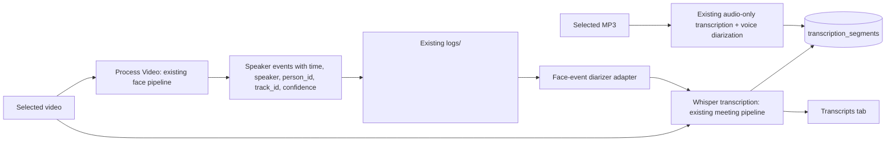

# Unified Video Transcription and Face-Based Speaker Labels

## Problem

The application currently exposes two separate video actions:

- `Process Video` runs face detection, tracking, recognition, and the shared face/audio speaker-attribution layer. Its speaker events are written to `logs/<video>.json` and `audio_logs`.
- `Transcribe Selected Video` separately extracts audio and runs Whisper plus voice-only diarization. It does not use face tracks or the face-based speaker events.

Thus the app can produce an annotated video and an independently diarized transcript, but the transcript speaker labels are not guaranteed to match recognized visible people. The button remains because these are currently separate pipelines.

The runtime summary also returns `GPU (CUDA)` as soon as PyTorch detects CUDA. In the current environment, PyTorch reports CUDA available while ONNX Runtime reports only Azure and CPU providers; face inference therefore runs on CPU even though the aggregate label says GPU.

## Goals

- Make the video action produce both the processed video and a transcript whose speaker labels come from the same face-based speaker-attribution events.
- Keep the existing MP3-only transcription action; audio-only inputs have no face observations and continue using voice diarization.
- Keep face detection, tracking, recognition, VAD, and the shared `SpeakerAttributor` as independent components. Orchestrate them rather than replacing them.
- Associate transcript words/segments and speaker events using their timestamps, not frame counts.
- Use the existing `SPEAKER_FACE_OVERLAP_THRESHOLD` (currently 0.8) as a configurable minimum coverage requirement. If an interval is uncovered or no speaker covers enough of it, label it `UNKNOWN` rather than guessing.
- Report Torch audio model and ONNX face model devices separately. Do not claim face GPU execution when `CUDAExecutionProvider` is unavailable.
- Preserve current audio logs and add no new tables for this workflow.

## Non-Goals

- Fixing/installing the ONNX Runtime CUDA provider in this change. The status display will accurately expose current provider availability; dependency/DLL remediation is a separate, evidence-led task.
- Changing speaker-attribution score weights or claiming measured accuracy gains. There is no labelled media set to measure WER or speaker-attribution accuracy.
- Removing audio-only MP3 transcription.
- Rewriting either face or audio processing pipeline.

## Recommended Design

### Approaches Considered

1. Keep separate video and transcript buttons. This preserves the current separation but leaves users with a face-attributed video and a different, voice-only transcript. It does not meet the requested combined result.
2. Run the existing face/video pipeline first, then transcribe and supply its timestamped speaker events as the diarization source. This reuses both engines and the existing `diarize` callback, makes the transcript labels follow visible recognized people, and limits new logic to orchestration and overlap assignment. **Recommended.** The trade-off is sequential processing and a second decode of the source media.
3. Merge transcription into the video frame loop. This could share some decode work, but would couple Whisper latency and its audio timing to face processing, require a broader pipeline redesign, and make failures harder to isolate. It is not justified before profiling proves duplicate decoding is a bottleneck.

### Data flow

1. `process_video_pipeline()` continues to create the annotated video and uses `SpeakerAttributor` to create speaker events. Its JSON speech-event records include `speaker`, `person_id`, `track_id`, `start_time`, `end_time`, `confidence`, and `source`.
2. After face/video processing succeeds, the Streamlit video action reads those events and calls `process_meeting_transcription()` with a diarization callback built from the event intervals.
3. `transcribe_with_diarization()` aligns the callback's intervals to Whisper word timestamps. If word timestamps are incomplete, its existing whole-segment fallback is used.
4. For each timed word/segment, assign the speaker only when a single face event covers at least `SPEAKER_FACE_OVERLAP_THRESHOLD` of the interval. Otherwise use `UNKNOWN`. This avoids assigning a full sentence to a speaker when only a small portion overlaps their event.
5. Existing `save_transcripts()` resolves recognized person names to `person_id` and persists the transcript. Unknown labels remain nullable-person rows.
6. MP3 processing continues to call `process_meeting_transcription()` without a face-event callback, so it uses the current voice-based diarization path.

### UI behavior

- For video files, replace the two separate buttons with one action, `Process Video + Transcript`.
- On success, report both the tracked-video output and transcript meeting ID.
- If video processing succeeds but transcription fails, preserve the tracked video and report the transcription failure as a partial result; do not mark the whole operation as if neither output exists.
- The MP3 path retains `Recognize Speakers & Transcribe Audio`.
- Remove the video-only `Transcribe Selected Video` action to avoid a second workflow that silently produces voice-only labels.

### Runtime reporting

Replace the aggregate `get_runtime_mode()` result with independently computed status values:

- **Torch audio runtime:** `CUDA (<device name>)` when `torch.cuda.is_available()`; otherwise `CPU`. If Torch import/probe fails, report `Unavailable`.
- **Face model runtime:** report provider availability truthfully without claiming active session execution. If `CUDAExecutionProvider` is listed, display `CUDA provider available (active session unverified)`; if only `CPUExecutionProvider` is listed, display `CPU (CUDA provider unavailable)`.

The UI must not collapse these into one `GPU` label. Runtime availability is not a utilization measurement; actual per-process GPU utilization remains best checked during inference with `nvidia-smi`.

### Interfaces

- Add a small adapter in `app.py` or `transcription_core.py` that accepts the processed-video speech events and returns the existing `diarize(audio_path, speech_regions)` callback shape: `(speaker_label, start_seconds, end_seconds)`.
- Add a configurable minimum overlap argument to the transcription assignment path, defaulting to current behavior for existing callers; the combined video path passes `config.SPEAKER_FACE_OVERLAP_THRESHOLD`.
- Speaker-event JSON shape includes stable within-run metadata (`person_id`, `track_id`) in addition to name/times/confidence. This does not make `track_id` globally unique across separate video runs.
- Runtime status helper returns a structured result with separate Torch and ONNX fields; Streamlit renders both.

## Error Handling and Data Safety

- Do not start face-based transcription if video processing fails; there is no valid face-event timeline to align.
- If no face speaker events exist, still transcribe the video and label segments `UNKNOWN`; do not silently fall back to voice identity for this combined-video action.
- Preserve output from a successfully completed first stage if the second stage fails.
- Do not delete existing transcripts or audio logs as part of reprocessing.
- Keep the existing MP3 transcription fallback unchanged.

## Testing

- Unit tests for interval coverage: full/threshold overlap assigns speaker; low/ambiguous/no overlap gives `UNKNOWN`; word timestamps split correctly at a speaker change.
- Pipeline test verifies the video workflow forwards the generated face-event intervals into transcription and does not invoke voice-only diarization for that run.
- UI/orchestration test verifies one video action runs face processing then transcription, and MP3 still runs audio-only transcription.
- Runtime-status tests mock Torch and ONNX provider availability independently, including Torch CUDA + ONNX CPU mixed status and Torch CUDA-probe failures that still preserve independent face-provider reporting.
- Run the full existing suite. Manual validation should process one multi-person video and inspect whether transcript labels align with face-event timelines; do not claim accuracy improvement without labelled references.

## Remaining Limitations

- The current face provider is CPU in the observed environment. This design makes that explicit but does not repair the missing ONNX CUDA provider.
- Timestamp overlap can only inherit the accuracy of the underlying face speaker events and Whisper word timestamps.
- The existing 0.8 overlap threshold and attribution mouth-motion threshold need calibration on real labelled recordings.
- Reprocessing remains a sequential workflow and may decode the source video/audio more than once; avoid a larger caching/streaming refactor unless profiling demonstrates it is necessary.
