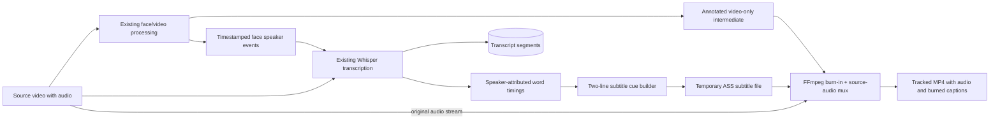

# Burned-In Subtitles and Source Audio for Tracked Videos

## Problem

`process_video_pipeline()` writes an annotated video with OpenCV's `VideoWriter`, which produces video-only output. It extracts source audio to a temporary WAV for VAD/speaker attribution and deletes that WAV afterward. The unified workflow then transcribes the source video and stores text in SQLite, but the tracked MP4 has neither its original audio nor subtitles burned into the picture.

## Goals

- Keep the original audio from the input video in the final tracked MP4, synchronized with its video.
- Burn subtitles directly into the tracked video so they appear in ordinary players without selecting a subtitle track.
- Use the existing Whisper result and timestamped face-speaker events; do not run a second transcription pass.
- Use speaker labels from the face-attributed transcript, including `UNKNOWN` when identity was not resolved.
- Generate readable, short captions from Whisper word timestamps: at most two lines per cue, target 42 characters per line, split at word boundaries, and split on speaker changes.
- Preserve the current tracked video with source audio if transcript generation or subtitle rendering fails; show a partial-success message rather than claiming the entire workflow failed.

## Non-Goals

- A selectable subtitle track or persistent `.srt` sidecar. The selected output is burned-in subtitles only.
- Translation or a second Whisper pass.
- Altering audio content, gain, or synchronization intentionally. The source audio is muxed unchanged where the container permits stream-copy; if its codec cannot be muxed into MP4, it is transcoded to AAC without mixing or applying filters.
- Replacing the existing face, VAD, Whisper, diarization, or video-processing engines.
- Claiming recognition accuracy improvements; there is no labelled subtitle/identity ground-truth set.

## Architecture



The integrated video workflow remains sequential:

1. Run the existing `process_video_pipeline()` to write an annotated video-only intermediate and speaker-event JSON.
2. Run Whisper once through the existing `process_meeting_transcription()` path, passing the face-event diarizer and collecting speaker-attributed word timing records through an optional callback.
3. Continue storing the usual merged transcript turns in SQLite. Independently, use the word-timing records to produce short caption cues; the callback does not change existing transcription return values or MP3 behavior.
4. Write a temporary UTF-8 ASS file with speaker name and text. `UNKNOWN` appears literally as the speaker label. Use a high-contrast bottom-aligned style with a fixed 1920x1080 script resolution and explicit line breaks, so font size is stable and libass does not add extra wrapped lines. Keep the speaker name visually distinct from the words.
5. Use FFmpeg's `subtitles`/libass filter to burn captions into the annotated intermediate, map the original source audio, and write the final tracked MP4. Convert the subtitle path to FFmpeg filter syntax with forward slashes and escaped filter-special characters (including the Windows drive colon, quotes, commas, and brackets); pass the filter expression as a subprocess argument without a shell.
6. Try audio stream-copy first; if the selected source audio codec cannot be muxed into MP4, retry with AAC audio encoding while retaining the same timestamps/content.
7. Remove temporary WAV/intermediate/subtitle files after successful finalization. If transcription or subtitle rendering fails, mux the original audio with the annotated intermediate to the tracked-output path before reporting partial failure. If that audio mux also fails, preserve the annotated silent video at the tracked-output path and include the audio error in the partial-failure message.

### Word/cue interface

Add a small immutable data type in a focused subtitle module:

```python
@dataclass(frozen=True)
class SubtitleWord:
    speaker_label: str
    start_ms: int
    end_ms: int
    text: str
```

An optional `subtitle_word_callback(SubtitleWord)` argument is threaded through `process_meeting_transcription()` to `transcribe_with_diarization()`. For reliable Whisper word timings, the callback receives each valid word with the speaker assigned from the same timestamped diarization intervals and the configured overlap threshold. When timings are missing/unreliable, split the segment text into whitespace-delimited words and distribute the segment interval proportionally to each word's character count, using the segment speaker assignment. These fallback times are estimates, not Whisper word timings; they keep captions short without another ASR pass.

The cue builder groups consecutive records only when speaker labels match and the inter-record gap is within a configurable subtitle gap. It wraps on word boundaries to no more than two explicit lines, targeting 42 characters per line. It starts a cue at the first word's `start_ms` and ends it at the last word's `end_ms`. Punctuation remains attached to its Whisper word. Long individual words are not split. Empty text and non-positive intervals are discarded. ASS text must render transcript backslashes/braces literally and normalize CR/LF so transcript content cannot inject formatting or break Dialogue rows.

### FFmpeg output contract

- Input 0: annotated video-only intermediate.
- Input 1: original source video.
- Video mapping: input 0 video, passed through the `subtitles` filter and encoded H.264.
- Audio mapping: first audio stream from input 1 if present; optional mapping permits silent/no-audio source videos.
- Preferred audio: `-c:a copy`; if FFmpeg reports that the stream cannot be placed in MP4, retry final mux with AAC. Do not map audio from the silent intermediate.
- Final output is written to a temporary path outside the tracked output folder and atomically replaces the tracked output only on success.
- If subtitle rendering fails, run the same source-audio mux without the subtitle filter before returning a partial failure.

## User Experience

- Video action remains `Process Video + Transcript`.
- On success, report the final tracked MP4 path, transcript meeting ID, and that captions/audio are included.
- If transcription, cue generation, or burn-in fails after the silent tracked video exists, mux/preserve the source audio on the clean tracked output where possible, retain it, and report a partial success with the path and failed stage. If both audio mux and silent fallback replacement fail, mark the output as not updated so the UI warns that the path may be stale or absent.
- MP3 flow remains audio-only and does not generate video or subtitles.
- If the input has no audio stream, output the tracked video with subtitles and no audio track; report no error solely because audio was absent.

## Testing

- Unit tests for cue grouping: speaker boundary, time gap, two-line/42-character wrapping, punctuation, empty text, invalid intervals, and same-speaker word timings.
- Transcription callback tests verify word speaker labels use face-event overlap and preserve existing list return/API behavior when callback is omitted.
- FFmpeg command tests verify video from the annotated intermediate and audio from the source are mapped, subtitle filter is applied, stream-copy retry behavior is attempted, and optional audio input is accepted.
- Workflow tests verify one Whisper pass, face events passed to transcription, finalization occurs after transcript/cue generation, transcription/subtitle failures preserve an audio-bearing tracked output, and audio-mux failure preserves the annotated silent video.
- MP3 regression tests verify its audio-only path is unchanged.
- Run the full test suite and perform one short real-video smoke test with source audio. Validate audio presence with `ffprobe`, captions visually in the resulting MP4, and cue times against the saved speaker-event JSON. This smoke test is functional, not an accuracy benchmark.

## Remaining Limitations

- The active face sessions were verified with `CUDAExecutionProvider` in the current installed venv. Runtime status still reports provider availability rather than querying a loaded session, so it explicitly does not claim session-level activity before model initialization.
- Word timings and speaker intervals are estimates; subtitles inherit their errors.
- Missing/unreliable word timings use proportional estimates across the original segment interval; estimated timing can be less accurate than Whisper word timing.
- Audio stream-copy may be unavailable for a particular input codec; AAC fallback preserves the audio content but re-encodes it.
